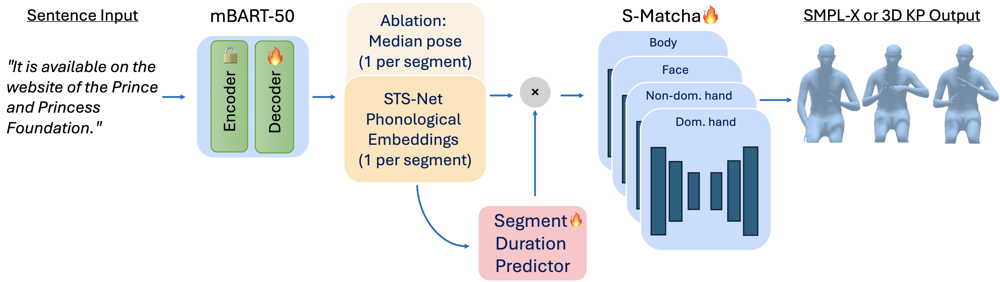

# S-Matcha: Expressive Sign Language Production Using Phonological Embeddings
 
Official code for **"Expressive Sign Language Production Using Phonological Embeddings"**.
 
Anna Klezovich\*, Fredrik Malmberg\*, Yunus Can Bilge, Johanna Mesch, Jonas Beskow
KTH Royal Institute of Technology, Stockholm, Sweden / The Finnish Ministry of Justice, Helsinki, Finland
 
\*Equal contribution
 
[Project page](https://www.speech.kth.se/research/s-matcha-phon/)



## Overview

S-Matcha is a gloss-free, end-to-end pipeline for continuous sign language production, from text to 3D signing. It combines:
 
- an **mBART-50** model that translates text into one phonological embedding per segment (sign or gap),
- a **segment duration predictor** that expands each segment to frame rate,
- a **flow-matching generative model** adapted from [Matcha-TTS](https://github.com/shivammehta25/Matcha-TTS), with separate streams for body, dominant hand, non-dominant hand and face,
- **phonology-aware embeddings** from a frozen [STS-Net](https://github.com/tmh-signlanguage/stsnet) encoder as the intermediate representation.

Two variants are provided:
 
| Variant | Conditioning |
|---|---|
| `S-Matcha-phon` | STS-Net phonological embeddings |
| `S-Matcha-pose` | Median pose of each segment (ablation) |


## Installation
 
```bash
git clone https://github.com/tmh-signlanguage/s-matcha-phon.git
cd s-matcha-phon
 
# TODO: add requirements.txt
conda create -n smatcha python=3.10
conda activate smatcha
pip install -r requirements.txt
```

## Data
 
We use three datasets, all in SMPL-X format (body, hands, jaw pose and 10 face parameters):
 
| Dataset | Language | Size | Source |
|---|---|---|---|
| Phoenix-2014T | DGS | 9 h | SMPL-X reconstructions from [SOKE](https://github.com/2000ZRL/SOKE) |
| How2Sign | ASL | 55.9 h | SMPL-X reconstructions from [SOKE](https://github.com/2000ZRL/SOKE) |
| STS-Mocap-v1 | STS | 2.5 h | [STS-Mocap-v1 on Huggingface](https://huggingface.co/datasets/AnnaKlez/STS-Mocap-v1/tree/main) |
 
## Preprocessing
 
1. Segment every clip into signs and gaps with a pretrained sign segmentation model.
2. Extract STS-Net embeddings per segment (256-d per stream, concatenated into 768-d for body, dominant hand and non-dominant hand, mean-pooled per segment).

```bash
# TODO
```

## Training
 
The model is trained in two stages, in isolation.
 
```bash
# Stage 1: text -> embeddings (mBART-50, frozen encoder, trained decoder)
# TODO
```

```bash
# Stage 2: embeddings -> motion (S-Matcha flow-matching decoder + duration predictor)
# TODO
```

## Inference
 
```bash
# TODO
```
 
At inference the model alternates between signs and gaps as a heuristic, and the duration predictor sets the length of each segment.

## Evaluation
 
Metrics:
 
- **Back-translation:** BLEU-1 to 4, chrF, ROUGE, WER, using a frozen pose-to-text model
- **Geometric:** DTW-MJE and DTW-PA-MJE
- **Signing space:** convex hull of both wrist positions, averaged per clip, as a percentage of ground truth
- **Duration:** median `pred/gt` frame ratio and median absolute error in seconds

The back-ranslation models that we used: TBD.

## Citation

TBD

## Acknowledgments
 
This work was financially supported by Swedish Research Council grant no. 2023-04548, the Wallenberg AI, Autonomous Systems and Software Program (WASP) and Digital Futures. Computational resources were provided by the National Academic Infrastructure for Supercomputing in Sweden (NAISS), funded by the Swedish Research Council.
 
The flow-matching architecture builds on [Matcha-TTS](https://github.com/shivammehta25/Matcha-TTS). SMPL-X reconstructions for Phoenix-2014T and How2Sign come from [SOKE](https://github.com/2000ZRL/SOKE).
 
## License
 
The code is distributed under MIT license, see LICENSE file.

